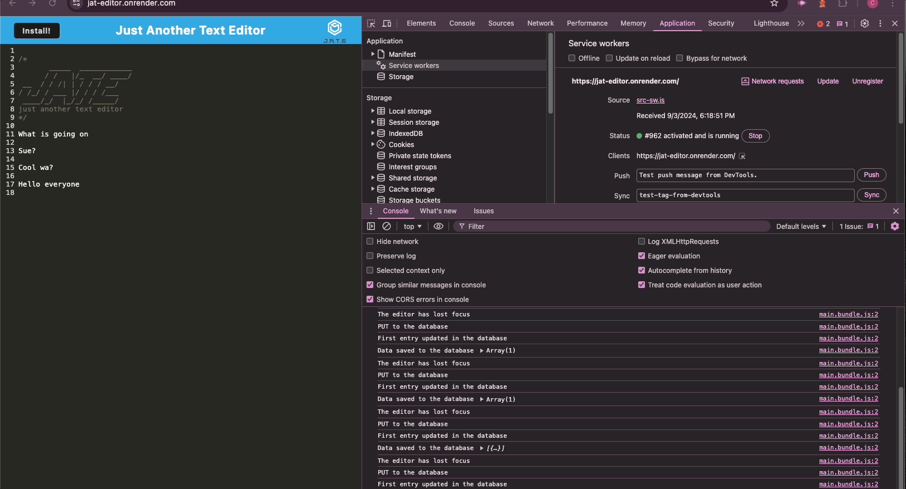
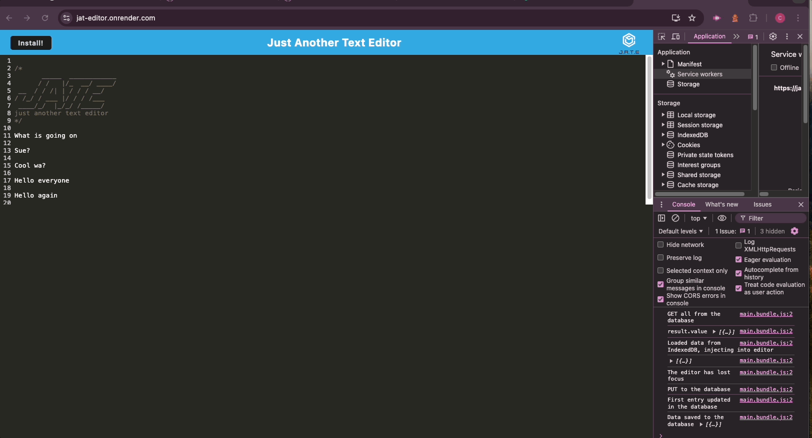
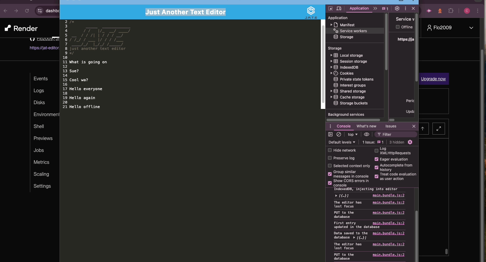

# Just Another Text Editor Project

## A project to practice the use of IndexedDB and Workbox

The Project enabled me to use the browser DB IndexedDB,  
which is a light weight DB for smaller projects.  
Furthermore, in this project I used a "service worker", which enables the web page  
to run offline and still to function. The application can also be installed which makes it 
a full PWA (Progressive Web App). 
This project allowed me to understand the fundamentals of PWA's and also learn how to structure 
the project into "client" and "server". 

## Table of Contents

- [Installation](#installation)
- [Usage](#usage)
- [Credits](#credits)
- [License](#license)
- [Badges](#badges)
- [Contributions](#contributions)
- [Questions](#questions)
- [Tests](#tests)

## Installation

The installation steps are as follows: 
First get the app from my GitHub (link below). 
Then run `npm install` in the `dev` folder. 
After that run `npm build` in the `dev` folder as well.  
When the the application is built a `dist` folder appears. 
Run now the `npm start:dev` command and the application starts. 
The command line will tell you on which Port the `web-dev`server` runs. 
Open a browser and under `locahost:Port` your application runs.

## Usage

The application's use is a `Text Editor` within the browser. 
You can also install the application onto your computer if wanted. 
Essentially you can write code, use it as a regular notebook or else. 

How to use the application: 
 
How to install the application: 
 
How de-install, delete and add text 

## Credits

https://stackoverflow.com 
https://www.npmjs.com/package/mini-css-extract-plugin 
https://chatgpt.com/ 
https://codemirror.net/

## License

https://opensource.org/license/mit

## Badges

## Contributions

Please contact me via mail.

## Questions

Flo2009

https://github/Flo2009

supersuse81@gmail.com

## Tests

Follow the link below to see the application running: 

https://jat-editor.onrender.com/

This is the link to the project in GitHub: 

https://github.com/Flo2009/JAT_Editor
